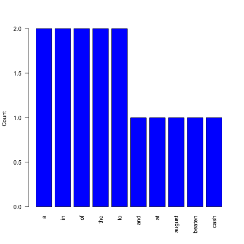

## Intro

- Text analytics is a rapidly developing field in data science, with tons of (possible) applications.
- But often it is a good idea to just get a basic overview of the text you would like to analyze.
- For this reason I started to develop an app that provides descriptive statistics for text segments. 
- This presentation introduces the app, which is still work-in-progress.

To access the app, simply go to https://andresito.shinyapps.io/textAnalysisShinyApp/.

--- 

## The App

The app is very straightforward and easy to use. All the user needs to do is insert text into a field, either by typing it out or by copy-pasting a segment to be analyzed.

Once the user hits 'submit', the app currently provides calculations for the following statistics:

- Total number of characters
- Mean word length
- Median word length
- A table of the 10 most common words in the text

The following page provides an example of the shiny output for the 10 most common words based on the following sample input:

"The death of James Foley in August at the hands of Islamic State jihadists in Syria was a very public end to a hidden ordeal shared with nearly two dozen other Westerners, who were routinely beaten, starved, subjected to waterboarding and sometimes traded for cash, his freed cellmates say." (Source: New York Times on October 26, 2014)

---

## Demo

 

---

## Outlook

Currently, the app is at a very early development stage.  In the future, it might include more complex calculations such as:

- the probability of words co-occuring next/close to each other;
- the probability of words occuring at certain positions in the text;
- analysis of the proportion of word types (nouns, verbs, adjectives, ...);
- as well as additional language options, as it is currently limited to English.

